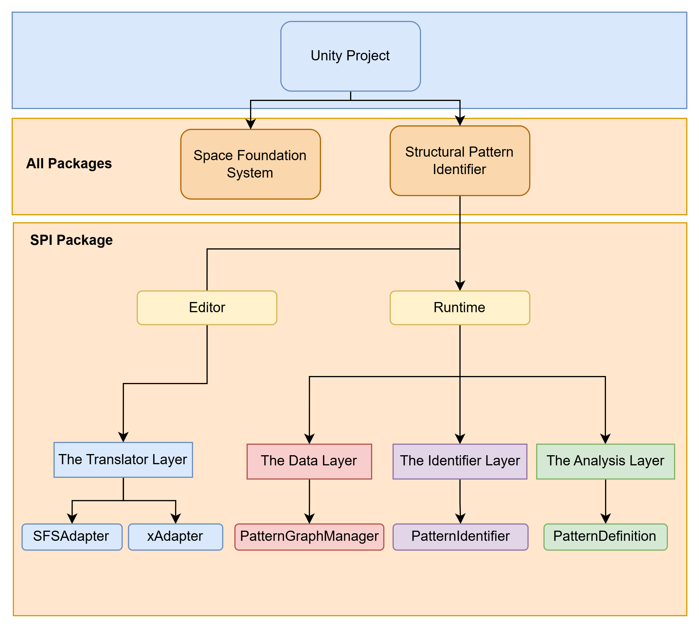
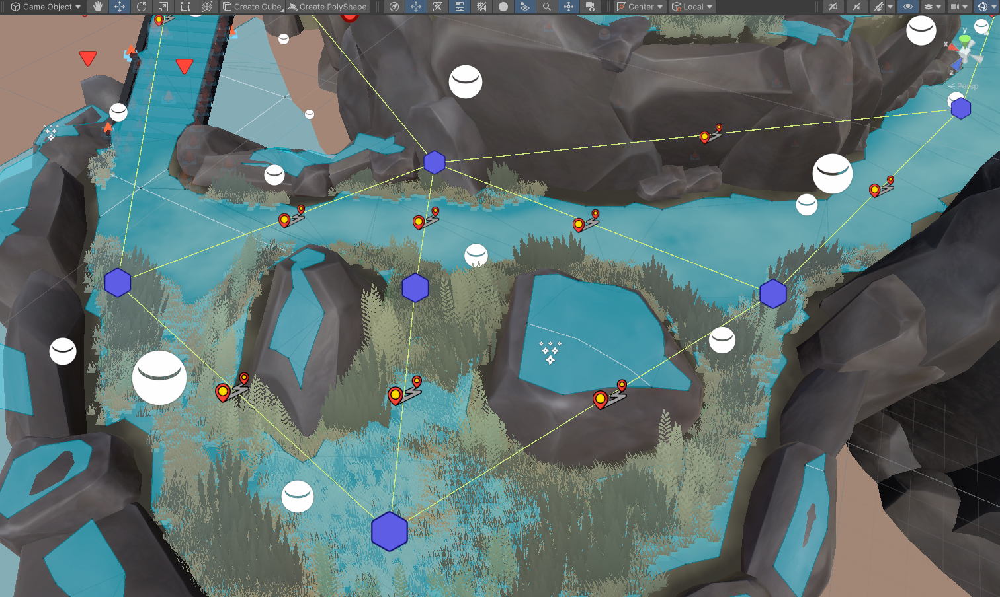
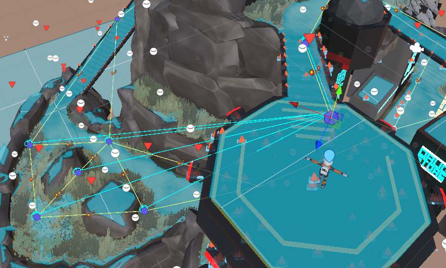
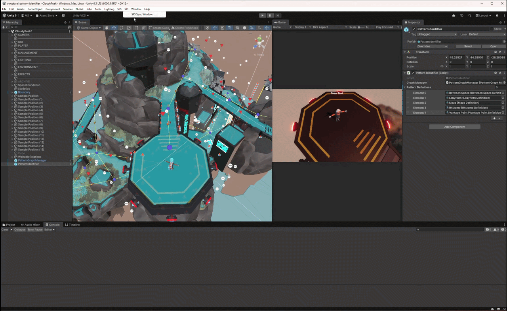
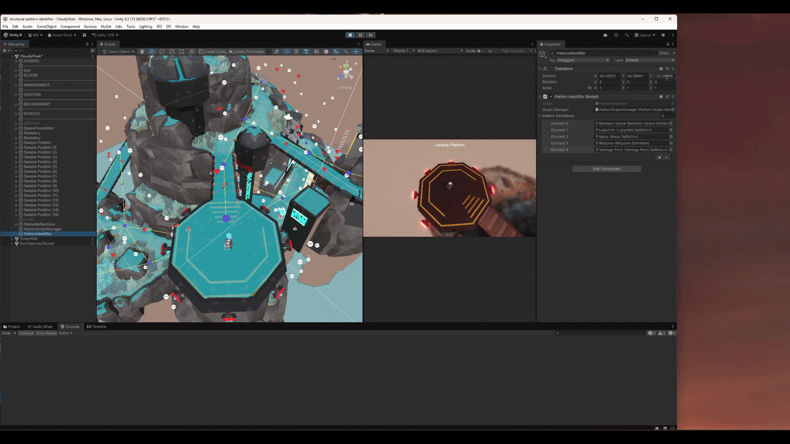

# **Formal Representation and Pattern Identification of Level Design Structures in Games**

This repository contains my implementation work for my master’s thesis at **Technical University of Munich (TUM)**, which focuses on the formalization of level design patterns within video game environments. This repository contains the implementation of the Structural Pattern Identifier (SPI) package, a framework that can algorithmically identify level design patterns in gamespaces.

 **Note:** This repository contains only the implementation of SPI framework. The dependencies of Space Foundation System (SFS) is intentionally omitted; SFS is an existing Unity package that generates a location graph. The code is not expected to compile. Its purpose is to showcase my contribution and architecture work.

In this project SFS's functionality is used to generate a location graph. The output of SFS framework is translated to an input suitable for SPI framework via SFSAdapter for further analysis. 

The architectural seperation of the translator layer decouples SPI from SFS framework, consequently allowing to change the data source and replacing SFS with an alternative spatial representation system. This can be done by implementing a new adapter layer in accordance with the chosen spatial representation system, without any modificiation to the core pattern identification logic inside the SPI framework.

  
  
<em>Project Structure</em>

## Summary of My Contribution

* Proposed a formal method to represent level design patterns
* Formalized level design patterns based on existing literature
* Architectured and implementated the Stuctural Pattern Identifier, an extendable framework to automatically detect patterns in Unity scenes
* Successful detection of different patterns tested on unit and complex Unity scenes

---

  
  
<em>Adding attributes to the nodes and relations</em>

  
   
  
<em>Generated Location Graph</em>

  
  
<em>Prepare input for SPI framework</em>

  
  
<em>SPI Result</em>

